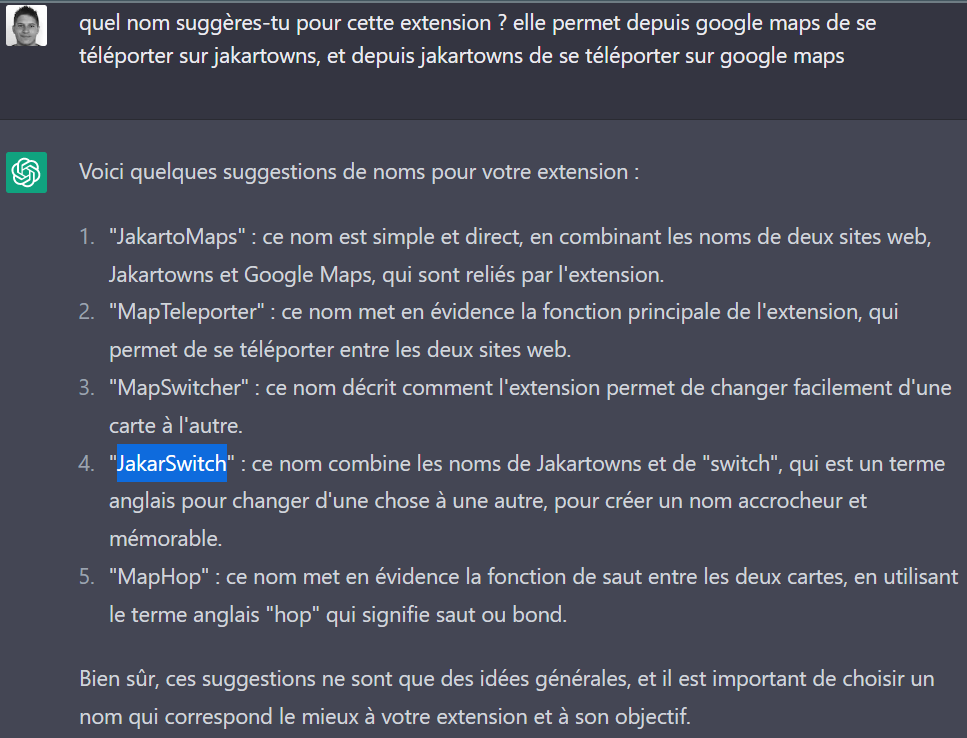

# JakarSwitch

JakarSwitch is an extension for webbrowsers (at least Google Chrome and Mozilla Firefox) that makes it easy to teleport between Jakartowns and other map providers (Google StreetView, Google Maps, Bing Maps, ...). Using this extension, you can quickly navigate between the two maps to discover places and points of interest.

## Features
Jump in: 
- Google Maps --> Jakartowns
- Google StreetView --> Jakartowns
- Asset Viewer --> Jakartowns
- Bing Maps --> Jakartowns

Jump out:
- Jakartowns --> Google StreetView

## Demo

## Installation (written by ChatGPT)

For Google Chrome

Here's how to install and activate the JakarSwitch extension from a zip file:

1. First, [download the JakarSwitch extension zip file](https://github.com/jakarto3d/jakarswitch/releases/latest) from a trusted source, such as the Jakarto Github.
2. Once the zip file is downloaded, extract it on your computer by right-clicking on it and selecting "Extract All".
3. Open Google Chrome and go to the "Settings" menu (represented by three vertical dots in the top right corner of the screen).
4. In the dropdown menu, select "More tools," then "Extensions".
5. Enable "developer mode" by clicking the corresponding button in the top right corner of the screen.
6. Click on the "Load unpacked extension" button that appears at the top of the screen.
7. In the file selection window that opens, navigate to the folder where you extracted the JakarSwitch extension files and select it.
8. Once you've selected the folder, click "Select folder" to load the extension into Chrome.
9. The JakarSwitch extension is now installed, but may not be automatically activated. To activate it, slide the switch next to "JakarSwitch" to the right to activate the extension.
10. The next time you visit Google StreetView or Jakartowns, the extension icon displayed in your toolbar will allow you to easily switch between the two sites.

It is important to note that installing an extension from a zip file can pose security risks, as it does not go through the validation and approval process of the Chrome Web Store. Therefore, it is important to download the zip file from a trusted source and verify that the extension is safe before installing it.

For Mozilla Firefox

Here's how to install and activate the JakarSwitch extension from a zip file:

1. First, [download the JakarSwitch extension zip file](https://github.com/jakarto3d/jakarswitch/releases/latest) from a trusted source, such as the Jakarto Github.
2. Once the zip file is downloaded, extract it on your computer by right-clicking on it and selecting "Extract All".
3. Open Firefox and go to the following webpage: [about:debugging#/runtime/this-firefox](about:debugging#/runtime/this-firefox)
4. Click on the "Load Temporary Add-on" button.
5. In the file selection window that opens, navigate to the folder where you extracted the JakarSwitch extension files and select the "manifest.json" file.
Once you've selected the manifest file, click "Open" to load the extension into Firefox.
6. The JakarSwitch extension is now installed and should be active.
7. The next time you visit Google StreetView or Jakartowns, the extension icon displayed in your toolbar will allow you to easily switch between the two sites.

It is important to note that installing an extension from a zip file can pose security risks, as it does not go through the validation and approval process of the Firefox Add-ons store. Therefore, it is important to download the zip file from a trusted source and verify that the extension is safe before installing it.

## Authors
- ideas came from Loïc Messal
- draft implementation directly from ChatGPT (really awesome!)
- some enhancements by Loïc Messal to make it work bidirectionnal

## Etymology

🤣

